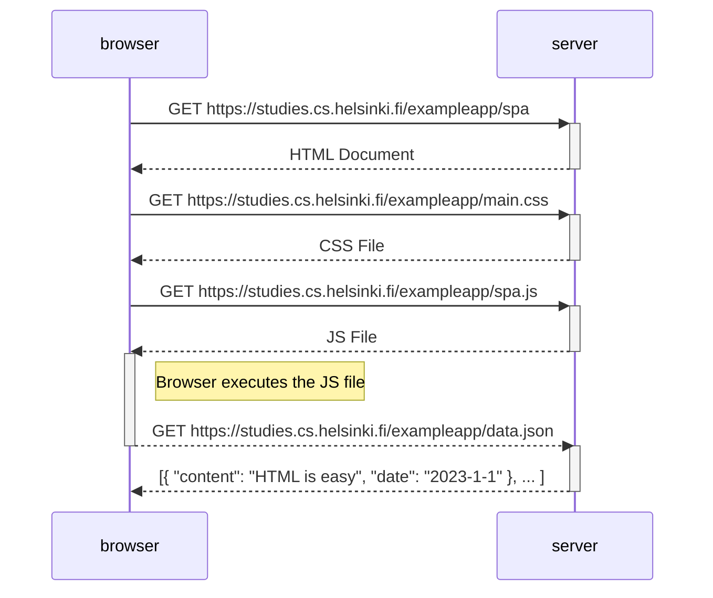

# Diagram for opening the Single page app

```mermaid
sequenceDiagram
    participant browser
    participant server

    browser->>+server: GET https://studies.cs.helsinki.fi/exampleapp/spa
    server-->>-browser: HTML Document

    browser->>+server: GET https://studies.cs.helsinki.fi/exampleapp/main.css
    server-->>-browser: CSS File

    browser->>+server: GET https://studies.cs.helsinki.fi/exampleapp/spa.js
    server-->>-browser: JS File
    activate browser
    Note right of browser: Browser executes the JS file
    browser-->>-server: GET https://studies.cs.helsinki.fi/exampleapp/data.json
    activate server
    server-->>-browser: [{ "content": "HTML is easy", "date": "2023-1-1" }, ... ]
```
