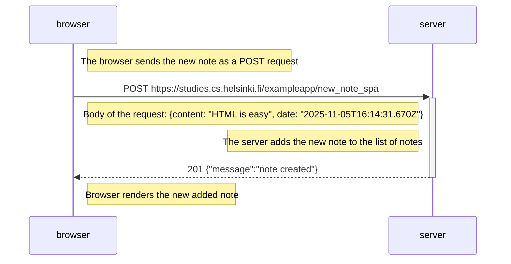

# Diagram for creating a new note in the Single page app

```mermaid
sequenceDiagram
    participant browser
    participant server

    Note right of browser: The browser sends the new note as a POST request
    browser->>+server: POST https://studies.cs.helsinki.fi/exampleapp/new_note_spa
    Note right of browser: Body of the request: {content: "HTML is easy", date: "2025-11-05T16:14:31.670Z"}
    Note left of server: The server adds the new note to the list of notes
    server-->>-browser: 201 {"message":"note created"}

    Note right of browser: Browser renders the new added note
```
