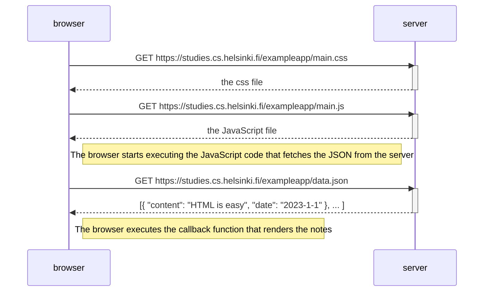
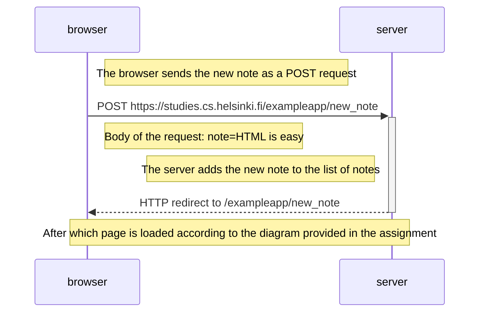

# [Diagram from the assignment](https://fullstackopen.com/en/part0/fundamentals_of_web_apps#java-script-libraries)

```mermaid
sequenceDiagram
    participant browser
    participant server


    browser->>server: GET https://studies.cs.helsinki.fi/exampleapp/main.css
    activate server
    server-->>browser: the css file
    deactivate server

    browser->>server: GET https://studies.cs.helsinki.fi/exampleapp/main.js
    activate server
    server-->>browser: the JavaScript file
    deactivate server

    Note right of browser: The browser starts executing the JavaScript code that fetches the JSON from the server

    browser->>server: GET https://studies.cs.helsinki.fi/exampleapp/data.json
    activate server
    server-->>browser: [{ "content": "HTML is easy", "date": "2023-1-1" }, ... ]
    deactivate server

    Note right of browser: The browser executes the callback function that renders the notes
```

# Diagram for creating new notes

```mermaid
sequenceDiagram
    participant browser
    participant server

    Note right of browser: The browser sends the new note as a POST request
    browser->>+server: POST https://studies.cs.helsinki.fi/exampleapp/new_note
    Note right of browser: Body of the request: note=HTML is easy

    Note left of server: The server adds the new note to the list of notes
    server-->>-browser: HTTP redirect to /exampleapp/new_note

    Note over browser, server: After which page is loaded according to the diagram provided in the assignment
```
